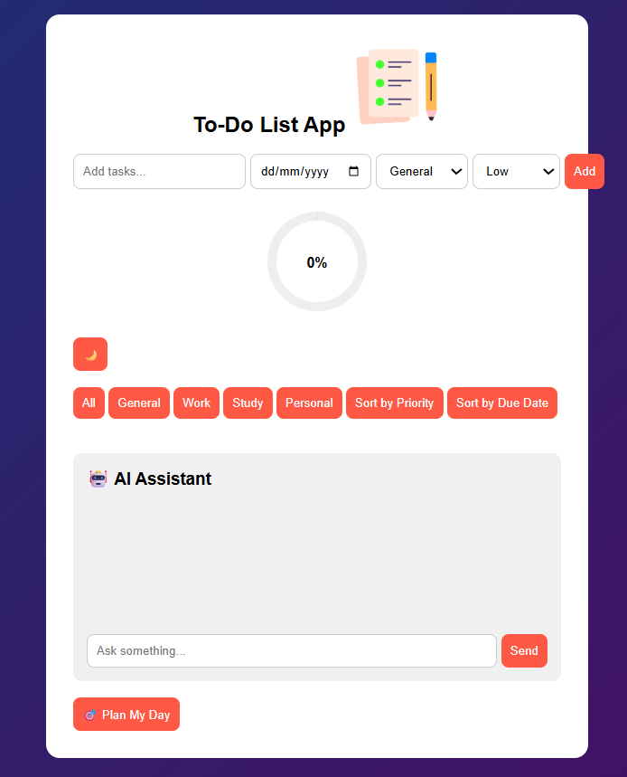
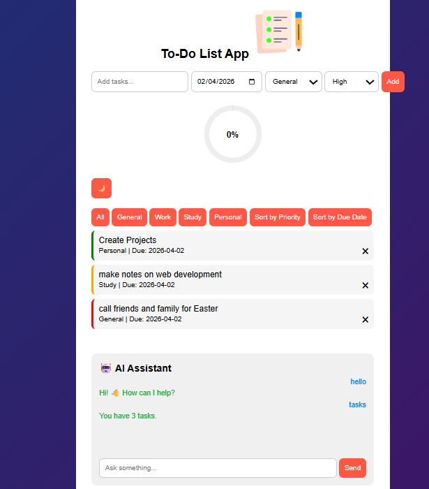
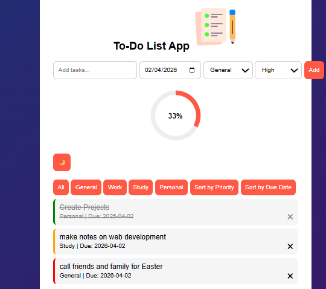
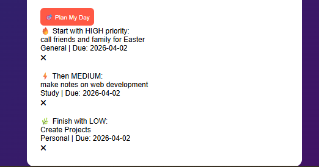
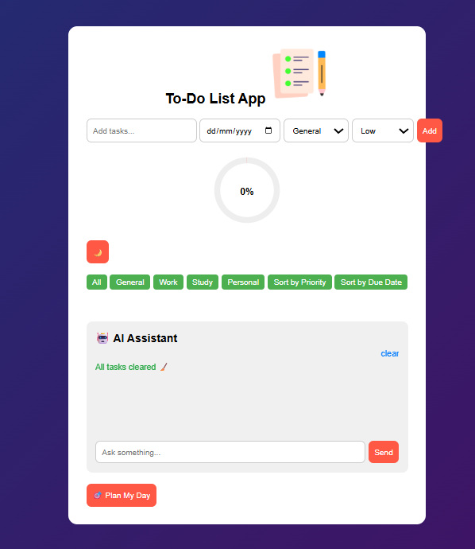

# To-Do-List-App

## 📌 Description
The To-Do List App is a dynamic and interactive task management web application built with HTML, CSS, and JavaScript. It allows users to create, organize, and track tasks efficiently with features like categories, priorities, due dates, filtering, sorting, and a built-in AI assistant — all within a responsive and user-friendly interface.

## 🛠 Prerequisites

To run this project, you only need:
* 🌐 A modern web browser (e.g., Chrome, Edge, Firefox, Safari)
  
## 📋 Features
* Add tasks with: Due dates, Categories (General, Work, Study, Personal), Priority levels (Low, Medium, High)
* Mark tasks as completed and delete tasks with smooth animations
* Persistent storage using localStorage
* 📊 Circular progress bar showing task completion percentage, Dynamic colour changes based on progress
* 🌙 Toggle between light and dark themes with saved preference
* 🔍 Filter tasks by category
* 🔃 Sort tasks by: Priority, due date
* 🤖 AI Assistant: Check number of tasks, Track completed tasks, Clear all tasks, Get productivity responses
* 🎯 “Plan My Day” feature (auto-organizes tasks by priority)
* ⏰ Automatic reminders for tasks due today
* ✨ Smooth animations for adding, removing, and filtering tasks
* 📱 Fully responsive and mobile-friendly design

## 💻 Technologies Used
The application is built with the following technologies:
* HTML
* CSS
* JavaScript

## 🚀 Installation
No installation is required to use the app. It is hosted online and can be accessed via a web browser.

## 📚 Usage
1. Open the application in your browser.
2. Enter a task in the input box, select a due date, category, and priority.
3. Click Add to save the task.
4. Click a task to mark it as completed
5. Click the ✖ icon to delete a task
6. Use filter buttons to view specific categories
Use sorting buttons to organize tasks
7. Use the 🌙 button to toggle dark mode.
8. Use the 🤖 AI assistant for insights
9. Click 🎯 Plan My Day to organize tasks by priority
10. Track progress using the circular progress indicator

## 🔗 Live Demo & Repository
Application can be viewed here: 
* [Live](https://yvonnesarah.github.io/To-Do-List-App/)

* [Repository](https://github.com/yvonnesarah/To-Do-List-App)

## 🖼 Screenshot(S)
Below is a preview of the To-Do List App:

## 🚀 Future Improvements
* Drag & drop task reordering
* Cloud sync (Firebase or backend)
* Real AI integration (OpenAI API)
* Notifications system
* User authentication

## 👥 Credit
This project was designed and developed by Yvonne Adedeji.

## 📜 License
This project is open-source. For licensing details, please refer to the LICENSE file in the repository.

## 📬 Contact
You can reach me at 📧 yvonneadedeji.sarah@gmail.com.
