# To-Do-List-App

## 📌 Description
The To-Do List App is a dynamic and interactive task management web application built with HTML, CSS, and JavaScript. It helps users efficiently create, organize, and track tasks with features like categories, priorities, due dates, filtering, sorting, drag-and-drop reordering — all within a responsive and modern UI.

## 🛠 Prerequisites

To run this project, you only need:
* 🌐 A modern web browser (Chrome, Edge, Firefox, Safari)
  
## 📋 Features
Task Management
* Add new tasks
* Edit tasks
* Delete tasks (with confirmation via toast)
* Mark tasks as completed / pending
* Persistent storage using localStorage
* Auto-load saved tasks on refresh

Task Organization Features

Task categories:
* General
* Work
* Study
* Personal

Priority levels:
* Low
* Medium
* High

* Due date assignment
* Pin important tasks to top
* Overdue task highlighting

## 💻 Technologies Used
The application is built with the following technologies:
* HTML
* CSS
* JavaScript
* LocalStorage
* SVG (Progress visualization)

## 🚀 Installation
No installation is required to use the app. It is hosted online and can be accessed via a web browser.

## 📚 Usage
1. Open the application in your browser.
2. Enter a task with:
* Title
* Category
* Priority
* Due date
3. Click Add Task
4. Manage tasks:
* ✔️ Click checkbox to complete
* ✏️ Edit task
* 📌 Pin important tasks
* ❌ Delete tasks
5. Use tools:
* Search bar for filtering
* Category filters
* Sorting buttons
* Dark mode toggle 🌙
6. Track progress with the circular progress indicator

## 🔗 Live Demo & Repository
Application can be viewed here: 
* 🌐 Live: https://yvonnesarah.github.io/To-Do-List-App/
* 💻 Repository: https://github.com/yvonnesarah/To-Do-List-App

## 🖼 Screenshot(S)
Before Design

To-Do List App

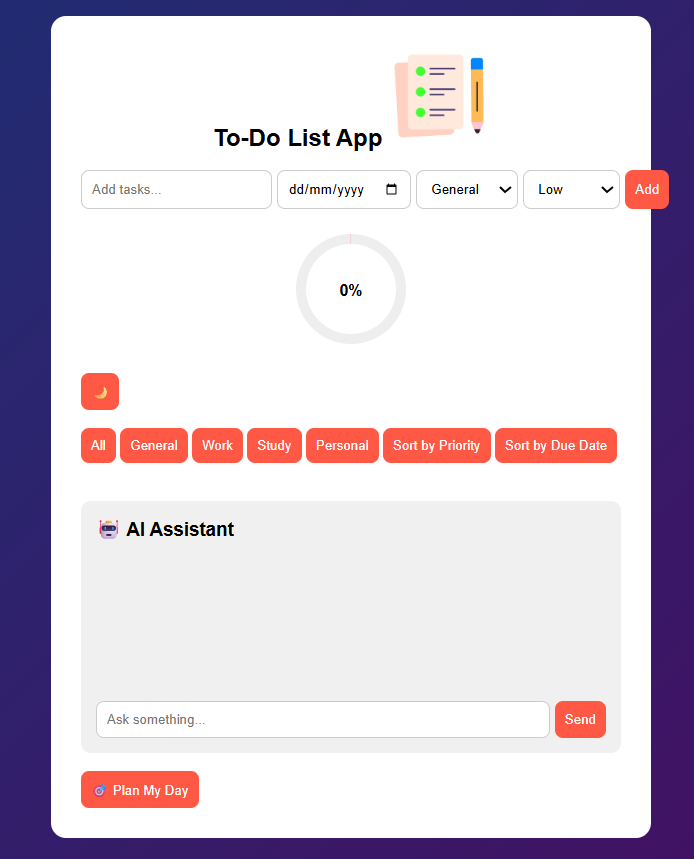

To-Do List App with AI Example

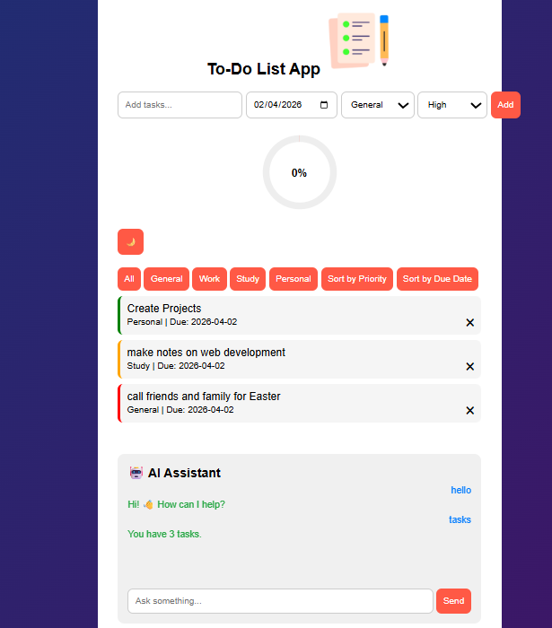

To-Do List App with complete task Example

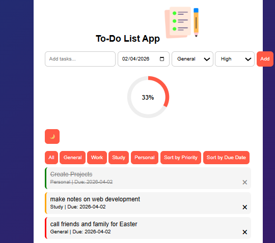

To-Do List App with plan my day Example

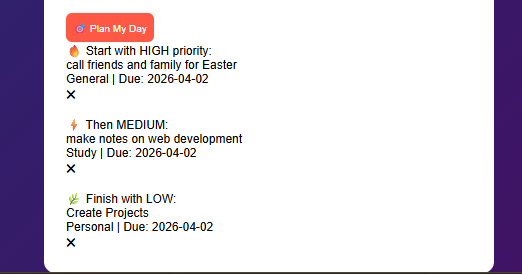

To-Do List App with clear task Example

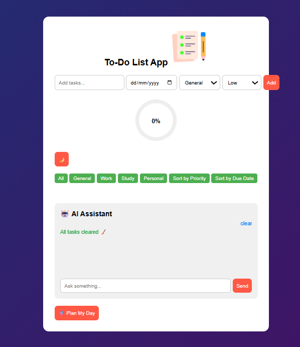

After Design

To-Do List App
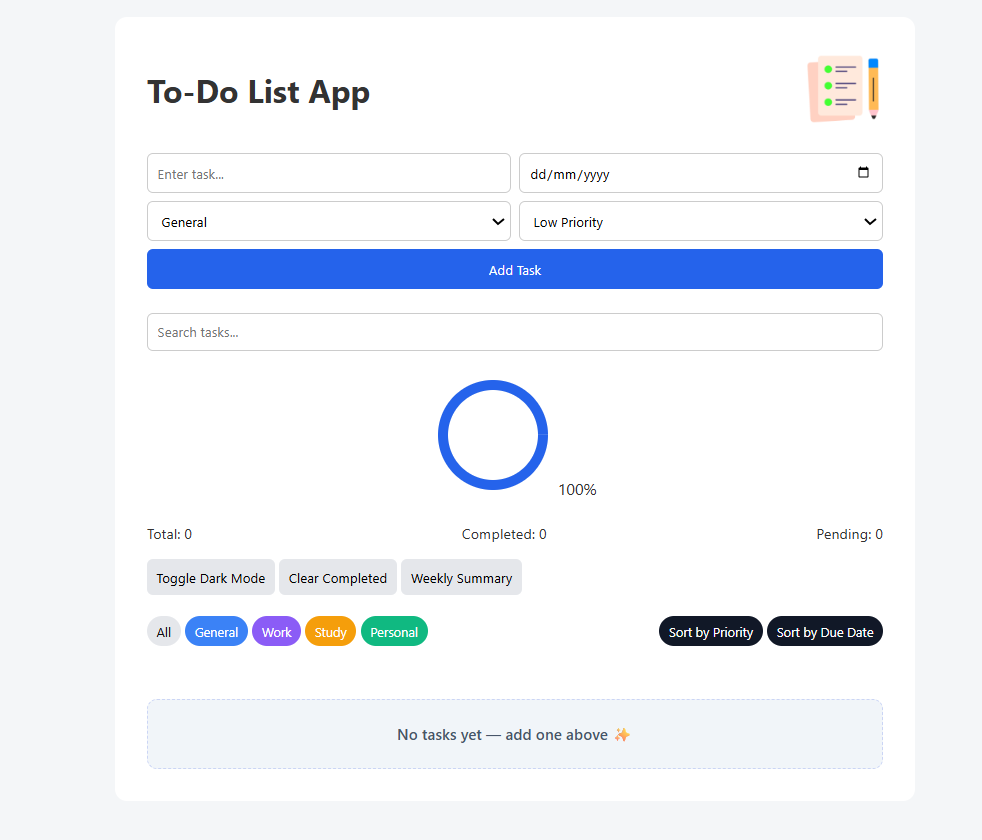

To-Do List App - Dark Theme
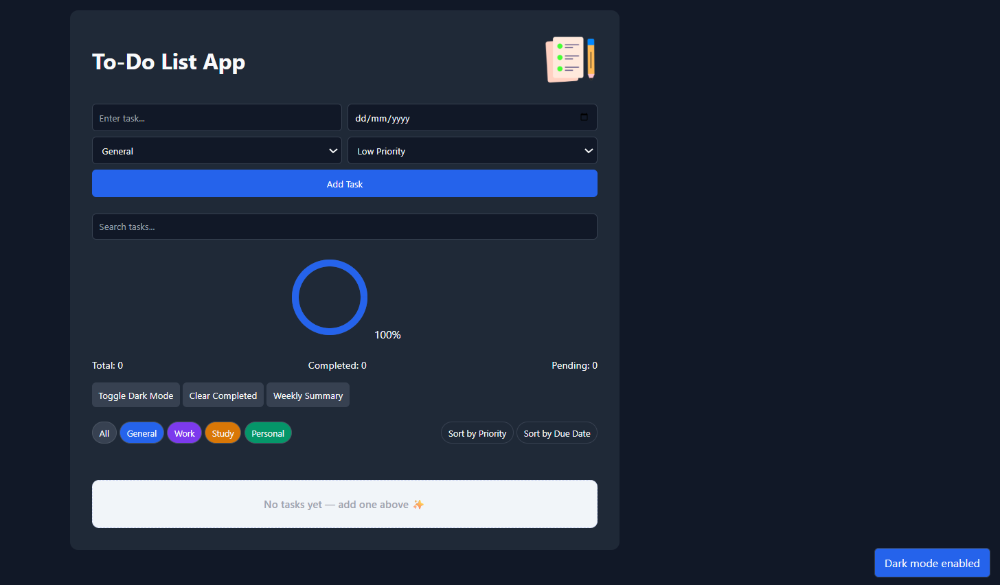

To-Do List App with Example

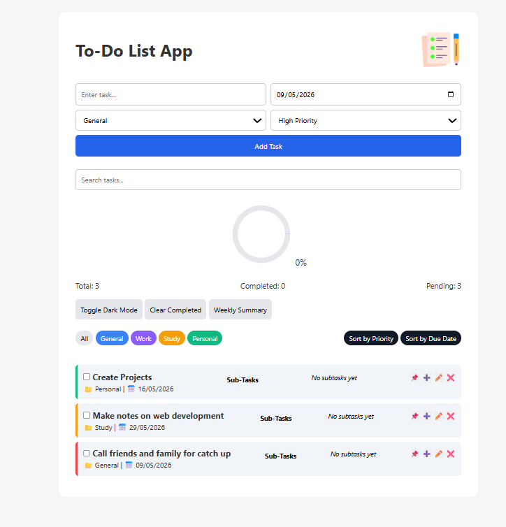

To-Do List App with complete task Example
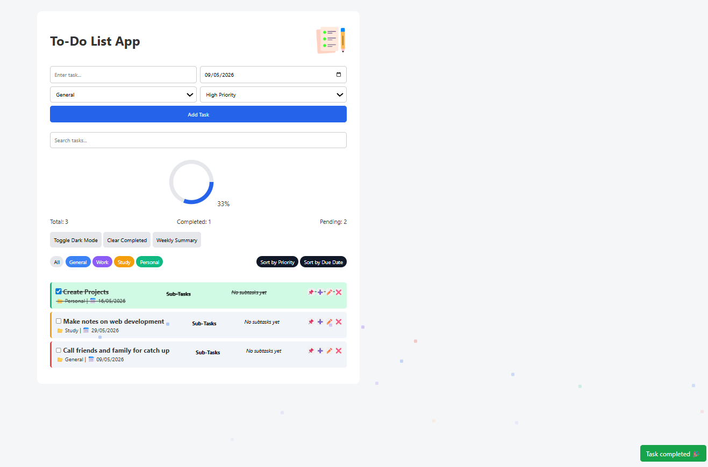

To-Do List App with pinned task Example
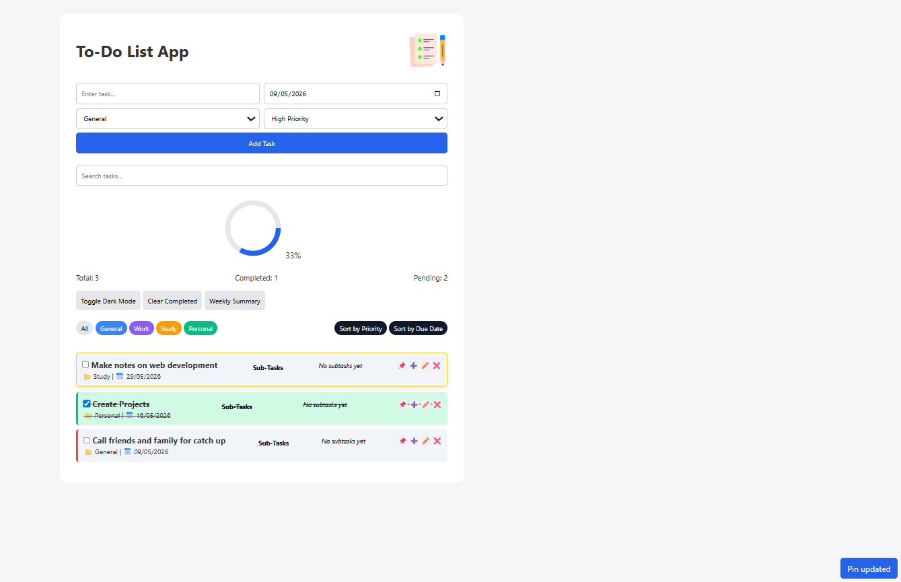

To-Do List App Subtask Example

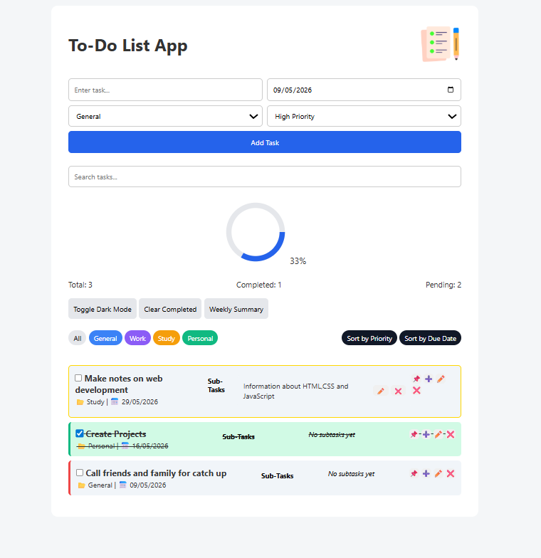

## 🗺️ Roadmap (Planned Features)
Search & Filter Features
* Real-time task search (text + category) ✅
* Filter tasks by category ✅
* Filter “All” view ✅

Sort tasks by:
* Priority ✅
* Due date ✅

Progress & Statistics
* Circular progress tracker (SVG-based) ✅
* Percentage completion indicator ✅

Task stats:
* Total tasks ✅
* Completed tasks ✅
* Pending tasks ✅

* Weekly summary report popup ✅

## 🚀 Upcoming Features
Subtask System
* Add subtasks under main tasks ✅
* Edit subtasks ✅
* Delete subtasks ✅
* Empty subtask state handling ✅

UI / UX Features
* Responsive layout (mobile-friendly) ✅
* Dark mode toggle with persistence ✅
* Toast notifications (success/error/info/warning) ✅
* Empty state UI when no tasks exist ✅

Smooth animations:
* Fade-in tasks ✅
* Fade-out deletion ✅
* Hover lift effects ✅

* Button click feedback animations ✅
* Confetti animation on task completion 🎉 ✅ 

## 🧠 Advanced Features (Professional Level)
Interaction Features
* Keyboard shortcut (Enter to add task) ✅
* Drag & drop task reordering ✅
* Checkbox toggle completion ✅
* Inline action buttons (edit, delete, pin, subtask add) ✅

System & Performance Features
* DOM element caching (performance optimization) ✅
* Modular JavaScript structure ✅ 
* Centralized render function (renderTasks) ✅
* State-driven UI updates ✅

LocalStorage persistence for:
* Tasks ✅
* Dark mode setting ✅

## 🧠 Challenges & Learnings
🚧 Challenges Faced

1. State Management Complexity
Managing tasks, subtasks, filtering, sorting, and persistence all at once became complex without a framework. Keeping UI in sync with localStorage and in-memory state required careful updates after every action.

2. Drag & Drop Reordering
Implementing custom drag-and-drop without external libraries was tricky, especially maintaining correct array indexes after reordering tasks.

3. Dynamic DOM Rendering
Since the UI is fully re-rendered on every change, ensuring performance and avoiding duplicate event listeners required structuring a clean renderTasks() function.

4. Nested Subtasks Handling
Supporting subtasks added another layer of nested state, making update and delete operations more error-prone.

5. Progress & Animation Syncing
Keeping the progress circle, statistics, and task list perfectly synchronized after each update required careful centralization of logic.

📚 Key Learnings

1. Vanilla JavaScript State Design
Learned how to simulate state management without frameworks by centralizing updates and re-rendering UI consistently.

2. DOM Manipulation Best Practices
Improved understanding of efficient DOM updates, event delegation, and avoiding unnecessary reflows.

3. User Experience Enhancements
Added micro-interactions like toast notifications, confetti effects, animations, and dark mode persistence to improve UX.

4. Local Storage Persistence
Gained practical experience storing and retrieving structured data using JSON.stringify() and JSON.parse().

5. Modular Function Design
Broke features into reusable functions (add, edit, delete, filter, sort), making the code easier to maintain and extend.

## 👥 Credit
Designed and developed by Yvonne Adedeji.

## 📜 License
This project is open-source. For licensing details, please refer to the LICENSE file in the repository.

## 📬 Contact
You can reach me at 📧 yvonneadedeji.sarah@gmail.com.
